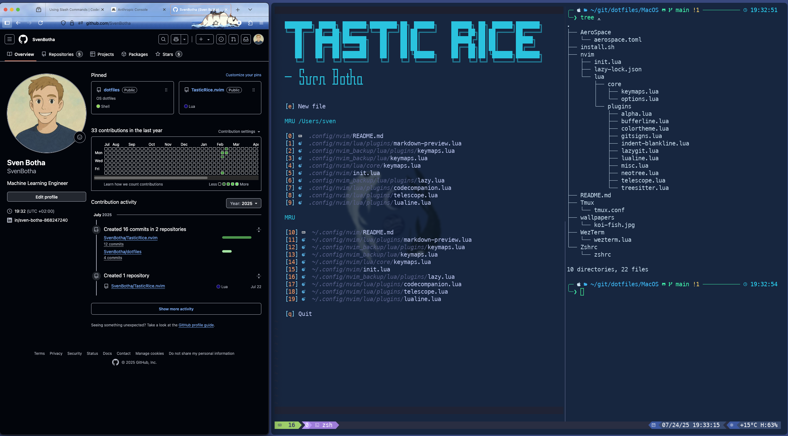

# 🍚 Tastic macOS

A comprehensive macOS development environment setup that gets you from zero to productive in minutes.



## 🚀 Quick Start

```bash
# Clone the repository
git clone <your-repo-url> ~/dotfiles
cd ~/dotfiles/MacOS

# Run the installation script
./install.sh
```

## 📦 What Gets Installed

### 🛠️ CLI Tools

- **git** - Version control
- **zsh** - Shell with Powerlevel10k theme
- **tmux** - Terminal multiplexer with plugins
- **neovim** - Text editor with full configuration
- **lazygit** - Git UI
- **fzf** - Fuzzy finder
- **eza** - Modern ls replacement
- **zoxide** - Better cd command
- **ripgrep** - Better grep
- **fd** - Better find
- **bat** - Better cat with syntax highlighting
- **htop** - Process viewer
- **tree** - Directory tree viewer
- **jq** - JSON processor
- **gh** - GitHub CLI
- **node** - Node.js runtime
- **python@3.12** - Python runtime

### 🖥️ GUI Applications

- **Firefox** - Web browser
- **Visual Studio Code** - Code editor
- **Microsoft Teams** - Communication
- **WezTerm** - Terminal emulator
- **AeroSpace** - Tiling window manager
- **Raycast** - Spotlight replacement

### 🔤 Fonts

- **MesloLGS Nerd Font** - Primary terminal font
- **Fira Code Nerd Font** - Alternative coding font
- **Hack Nerd Font** - Alternative coding font

## 📁 Configuration Files

The script copies the following configurations to their appropriate locations:

| Source                     | Destination         | Purpose                 |
| -------------------------- | ------------------- | ----------------------- |
| `Zshrc/zshrc`              | `~/.zshrc`          | Zsh shell configuration |
| `WezTerm/wezterm.lua`      | `~/.wezterm.lua`    | WezTerm terminal config |
| `AeroSpace/aerospace.toml` | `~/.aerospace.toml` | Window manager config   |
| `Tmux/tmux.conf`           | `~/.tmux.conf`      | Tmux configuration      |
| `nvim/`                    | `~/.config/nvim/`   | Neovim configuration    |
| `wallpapers/koi-fish.jpg`  | Desktop wallpaper   | System wallpaper        |

## 🔧 Manual Setup Steps

After running the installation script, complete these steps:

1. **Restart your terminal** or source the new configuration:

   ```bash
   source ~/.zshrc
   ```

2. **Configure Powerlevel10k theme**:

   ```bash
   p10k configure
   ```

3. **Start AeroSpace**:
   - Open the Applications folder
   - Launch AeroSpace
   - Grant necessary permissions

4. **Verify WezTerm**:
   - Open WezTerm from Applications
   - Verify the custom theme and font

5. **Setup Neovim**:
   - Launch `nvim`
   - Let Lazy.nvim automatically install plugins
   - Exit and restart nvim once installation is complete

## ⚙️ Key Features

### 🐚 Shell (Zsh + Powerlevel10k)

- Beautiful, informative prompt
- Syntax highlighting
- Auto-suggestions
- History search with arrow keys
- Modern aliases (`ls` → `eza`, `cd` → `zoxide`)

### 🖥️ Terminal (WezTerm)

- Custom "Coolnight" color scheme
- Optimized font rendering
- Transparent background with blur
- Lightweight and fast

### 🪟 Window Manager (AeroSpace)

- Tiling window management
- Vim-like keybindings
- Multi-monitor support
- Workspace management

### 📝 Editor (Neovim)

- Full IDE-like experience
- LSP support
- Syntax highlighting
- File explorer
- Git integration
- Fuzzy finding

### 🔀 Terminal Multiplexer (Tmux)

- Session management
- Pane splitting
- Plugin ecosystem (TPM)
- Tokyo Night theme
- Vim-like navigation

## 🎯 Key Bindings

### AeroSpace (Window Manager)

- `Alt + Enter` - Open WezTerm with tmux
- `Alt + W` - Open Firefox
- `Alt + C` - Open VS Code
- `Alt + H/J/K/L` - Navigate windows
- `Alt + 1-7` - Switch workspaces
- `Alt + Shift + H/J/K/L` - Move windows
- `Alt + Shift + 1-7` - Move window to workspace

### Tmux

- `Ctrl + Space` - Prefix key
- `Prefix + H` - Horizontal split
- `Prefix + V` - Vertical split
- `Prefix + X` - Close pane
- `Prefix + R` - Reload config

## 🔄 Updating

To update your configurations:

1. Pull the latest changes:

   ```bash
   cd ~/dotfiles/MacOS
   git pull
   ```

2. Re-run the install script:
   ```bash
   ./install.sh
   ```

The script will backup your existing configurations before overwriting them.

## 🗂️ Repository Structure

```
MacOS/
├── install.sh                 # Main installation script
├── sven_tastic_rice_install.sh # Old script (deprecated)
├── README.md                  # This file
├── commands.txt               # Additional commands reference
├── AeroSpace/
│   └── aerospace.toml         # Window manager config
├── nvim/                      # Neovim configuration
│   ├── init.lua
│   ├── lazy-lock.json
│   └── lua/
├── Tmux/
│   └── tmux.conf             # Tmux configuration
├── WezTerm/
│   └── wezterm.lua           # Terminal configuration
├── Zshrc/
│   └── zshrc                 # Shell configuration
└── wallpapers/
    └── koi-fish.jpg          # Desktop wallpaper
```

## 🛡️ Backup & Safety

The installation script automatically:

- Backs up existing configuration files with timestamps
- Checks for existing installations before installing
- Uses safe copy operations
- Provides colored output for easy debugging

Backup files are created in the format: `<original-file>.backup.YYYYMMDD_HHMMSS`

## 🐛 Troubleshooting

### Homebrew Issues

```bash
# Reset Homebrew PATH
eval "$(/opt/homebrew/bin/brew shellenv)"

# Or for Intel Macs
eval "$(/usr/local/bin/brew shellenv)"
```

### Font Issues

- Ensure your terminal is using "MesloLGS Nerd Font Mono"
- Restart your terminal after font installation

### Permission Issues

- Grant necessary permissions to AeroSpace in System Preferences
- Allow terminal applications in Security & Privacy

### Tmux Plugin Issues

```bash
# Manually install TPM
git clone https://github.com/tmux-plugins/tpm ~/.tmux/plugins/tpm

# Install plugins
~/.tmux/plugins/tpm/bin/install_plugins
```

## 🤝 Contributing

This is a personal dotfiles repository, but suggestions and improvements are welcome via issues or pull requests.

---
